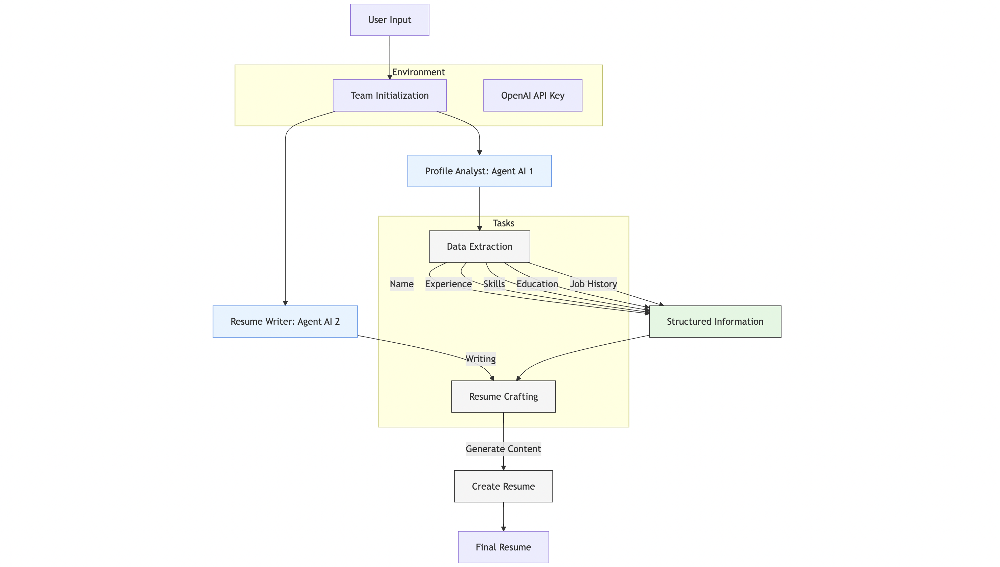

# Building Resume Creator Using Multi-agent AI System

Photo by <a href="https://unsplash.com/@joaofferrao?utm_content=creditCopyText&utm_medium=referral&utm_source=unsplash">João Ferrão</a> on <a href="https://unsplash.com/photos/white-printer-paper-on-macbook-pro-4YzrcDNcRVg?utm_content=creditCopyText&utm_medium=referral&utm_source=unsplash">Unsplash</a>

## Limitations of Manual Resume Processing

### Inefficient Information Gathering

The manual process of collecting and organizing information is time-consuming and requires significant effort. This is in contrast to KaibanJS which can automatically extract structured information from user inputs.

### Inconsistent Formatting

Manual resume creation often leads to formatting inconsistencies. The process requires manual adjustments to maintain professional formatting standards, which can be error-prone and time-consuming.

### Content Writing and Rewriting Challenges

The manual process requires significant effort in crafting and editing content. Writing compelling and well-structured content by hand is labor-intensive, requiring multiple revisions and edits.

## Automating Resume Creation using AI

Creating a resume manually involves several steps:

1. **Information Gathering**: Collecting and organizing your personal details, job history, skills, and education.
2. **Formatting**: Ensuring the resume looks attractive and professional, often without clear guidelines.
3. **Content Writing**: Crafting and refining content to make it concise, compelling, and relevant.
4. **Proofreading and Editing**: Checking for errors and polishing the resume to a professional standard.

With the AI system, we can automate these steps using multi-agent systems. Each agent performs a specific task, such as extracting information, generating content, or formatting the resume. By coordinating these agents, we can create a fully automated resume creation system.

### How it Works?

In this blog, we automate the **information gathering** and **content writing** for the resume, tasks that are usually manual and time-consuming.

