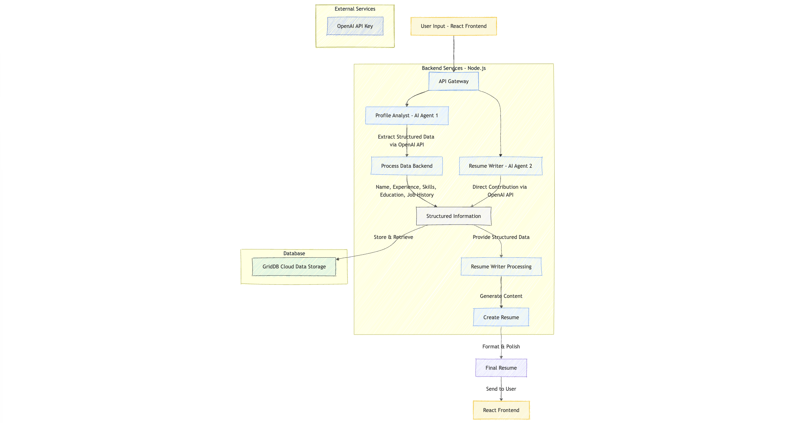
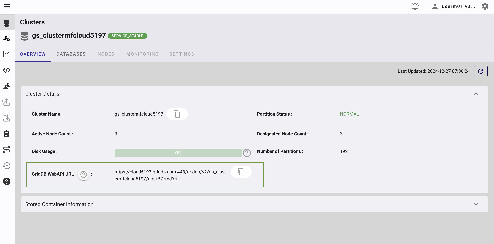
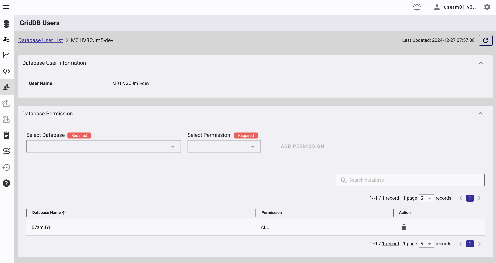
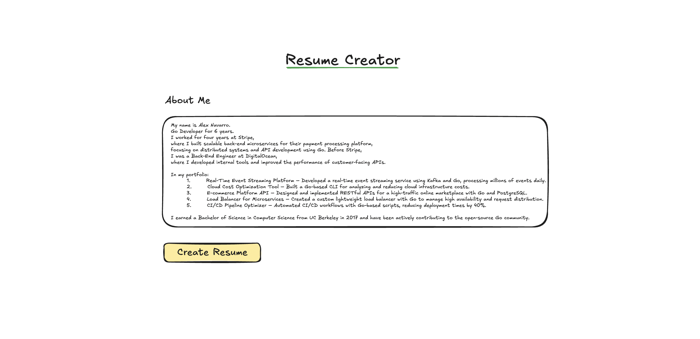
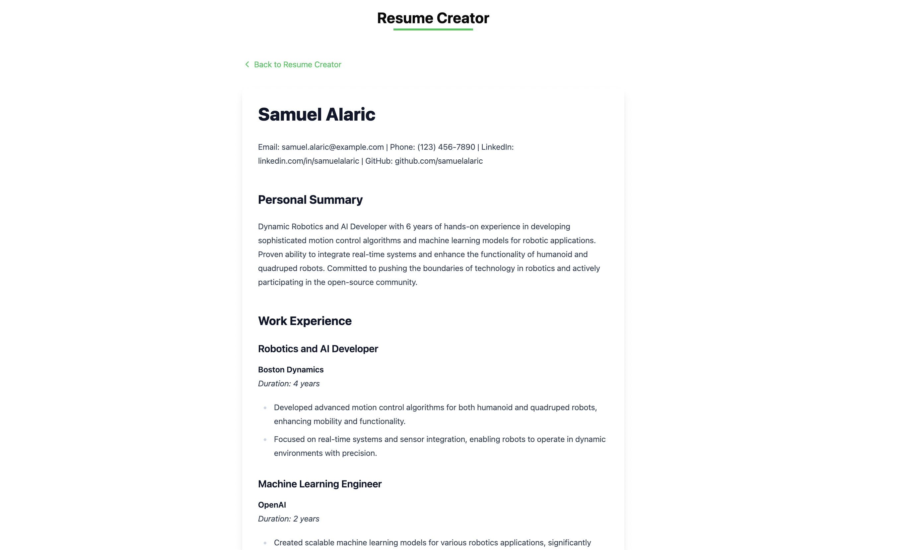

# Building Resume Creator with Multi-agent AI


Photo by [João Ferrão](https://unsplash.com/@joaofferrao?utm_content=creditCopyText&utm_medium=referral&utm_source=unsplash) on [Unsplash](https://unsplash.com/photos/white-printer-paper-on-macbook-pro-4YzrcDNcRVg?utm_content=creditCopyText&utm_medium=referral&utm_source=unsplash)

In this blog, we will build an AI-powered resume creation system that automates the tedious and time-consuming tasks involved in manual resume creation. By leveraging multi-agent AI systems, we will streamline the process of information gathering, and content writing to produce resumes with minimal human intervention.

## Limitations of Manual Resume Processing

### Inefficient Information Gathering

The manual process of collecting and organizing information is time-consuming and requires significant effort.

### Inconsistent Formatting

Manual resume creation often leads to formatting inconsistencies. The process requires manual adjustments to maintain professional formatting standards, which can be error-prone and time-consuming.

### Content Writing and Rewriting Challenges

The manual process requires significant effort in crafting and editing content. Writing compelling and well-structured content by hand is labor-intensive, requiring multiple revisions and edits.

## Automating Resume Creation using AI

Creating a resume manually involves several steps:

1. **Information Gathering**: Collecting and organizing your personal details, job history, skills, and education.
2. **Formatting**: Ensuring the resume looks attractive and professional, often without clear guidelines.
3. **Content Writing**: Crafting and refining content to make it concise, compelling, and relevant.
4. **Proofreading and Editing**: Checking for errors and polishing the resume to a professional standard.

With the AI system, we can automate these steps using multi-agent systems. Each agent performs a specific task, such as extracting information, generating content, or formatting the resume. By coordinating these agents, we can create a fully automated resume creation system.

## Running the Resume Creator

Before we dive into the technical details, you can run the resume creator system by following these steps:

1) Clone the repository:

    ```bash
    git clone https://github.com/junwatu/resume-creator-multi-agent-ai.git
    ```

2) Install the dependencies:

    ```bash
    cd resume-creator-multi-agent-ai
    cd apps
    npm install
    ```

3) Create a `.env` file in the `apps` directory and add the following environment variables:

    ```ini
    OPENAI_API_KEY=api-key-here
    GRIDDB_WEBAPI_URL=
    GRIDDB_USERNAME=
    GRIDDB_PASSWORD=
    VITE_APP_BASE_URL=http://localhost
    VITE_PORT=3000
    ```

    Please refer to the [Prerequisites](#prerequisites) section for more details on obtaining the OpenAI API key and GridDB credentials.

4) Start the server:

    ```bash
    npm run start
    ```

5) Open your browser and go to `http://localhost:3000` to access the resume creator system.

## How it Works?

In this blog, we automate the **information gathering** and **content writing** for the resume, tasks that are usually manual and time-consuming.

This system diagram illustrates the resume creation process discussed in this blog, showcasing the collaboration between two main AI agents:



Here's a brief description:

- The system starts with **User Input** and requires an environment setup that includes **Team Initialization** and **OpenAI API Key**.

- Two AI agents work together:
  - **Profile Analyst (Agent AI 1)**: Handles data extraction from user input, breaking down information into categories like **Name**, **Experience**, **Skills**, **Education**, and **Job History**.
  - **Resume Writer (Agent AI 2)**: Takes the structured information and handles the writing aspect.

- The workflow follows these key steps:
  - **Data Extraction**: Organizes raw user input into. structured categories. This the information gathering step.
  - **Structured Information**: Stores the organized data into the GridDB Cloud database.
  - **Resume Crafting**: Combines the structured data with writing capabilities. This the content writing step.
  - **Create Resume**: Generates the content.
  - **Final Resume**: Produces the completed document.

## Prerequisites

### KaibanJS

[KaibanJS](https://www.kaibanjs.com/) is the JavaScript framework for building multi-agent AI systems. We will use it to build our resume creation system.

### OpenAI

We will use the [`o1-mini`](https://platform.openai.com/docs/models#o1) model from OpenAI. It is a smaller version of the `o1` model, suitable for tasks that require complex reasoning and understanding.

Create a project, an API key, and enable the `o1-mini` model in the [OpenAI platform](https://platform.openai.com/). Make sure to save the API key in the `.env` file.

```ini
OPENAI_API_KEY=api-key-here
```

### GridDB Cloud

The GridDB Cloud offers a free plan tier and is officially available worldwide. This database will store the structured information extracted by the **Profile Analyst** agent and also the final resume generated by the **Resume Writer** agent.

You need these GridDB environment variables in the `.env` file:

```ini
GRIDDB_WEBAPI_URL=
GRIDDB_USERNAME=
GRIDDB_PASSWORD=
```

Check the below section on how to get these values.

#### GridDB WebAPI URL

Go to the GridDB Cloud portal and copy the WebAPI URL from the **Clusters** section. It should look like this:



#### GridDB Username and Password

Go to the **GridDB Users** section of the GridDB Cloud portal and cretae or copy the username for `GRIDDB_USERNAME`. The password is set when the user is created for the first time, use this as the `GRIDDB_PASSWORD`.



For more details, to get started with GridDB Cloud, please follow this [quick start guide](https://griddb.net/en/blog/griddb-cloud-quick-start-guide/).

### Node.js

We will use Node.js LTS v22.12.0 to build a server that handles the communication between the user interface, AI agents and OpenAI API and store data into the GridDB Cloud database.

### React

We will use React to build the user interface for the resume creation system. Where the user can input their details and generate a resume with click of a button.

## Building the Resume Creation System

### Node.js Server

We will use Node.js to build the server that handles the communication between the user interface, AI agents, and OpenAI API. The server will also store the structured information into the GridDB Cloud database.

This table provides an overview of the API routes defined in the `server.js` code, including HTTP methods, endpoints, descriptions, and any parameters.

| HTTP Method | Endpoint             | Description                                     | Parameters                    |
|-------------|----------------------|-------------------------------------------------|--------------------------------|
| POST        | `/api/resumes`       | Creates a new resume. Calls the `generateResume` function to generate content, saves to the database, and returns the response. | **Body**: `{ content: string }` |
| GET         | `/api/resumes`       | Fetches all resumes stored in the database.     | None                          |
| GET         | `/api/resumes/:id`   | Fetches a specific resume by its ID.            | **Path**: `id` (Resume ID)    |
| DELETE      | `/api/resumes/:id`   | Deletes a specific resume by its ID.            | **Path**: `id` (Resume ID)    |

The main route code for the resume creation is as follows:

```javascript
app.post('/api/resumes', async (req, res) => {
 try {
  const resumeData = req.body || {};
  const result = await generateResume(resumeData.content || undefined);
  console.log(result);

  const resume = {
   id: generateRandomID(),
   rawContent: resumeData.content,
   formattedContent: result.result,
   status: result.status,
   createdAt: new Date().toISOString(),
   information: JSON.stringify(result.stats),
  }

  // Save resume to database
  const dbResponse = await dbClient.insertData({ data: resume });

  if (result.status === 'success') {
   const all = {
    message: 'Resume created successfully',
    data: result.result,
    stats: result.stats,
    dbStatus: dbResponse
   }
   res.status(201).json(all);
  } else {
   res.status(400).json({
    message: 'Failed to generate resume',
    error: result.error
   });
  }
 } catch (error) {
  res.status(500).json({
   error: 'Server error while creating resume',
   details: error.message
  });
 }
});
```

When the user submits their data, the server calls the `generateResume` function to generate the resume content. The result is then saved to the GridDB Cloud database and also returned the resume content as a response.

### Multi-agent AI

We will use KaibanJS to build the multi-agent AI system for the resume creation process. You can find the agent code in the `team.kban.js` file and this system consists of two main agents:

#### Profile Analyst (Agent AI 1)

The **Profile Analyst** agent is responsible for extracting structured information from the user input. It categorizes the input into fields such as **Name**, **Experience**, **Skills**, **Education**, and **Job History**. The effectiveness of these fields depends on the quality and diversity of the submitted data.

```js
const profileAnalyst = new Agent({
  name: 'Carla Smith',
  role: 'Profile Analyst',
  goal: 'Extract structured information from conversational user input.',
  background: 'Data Processor',
  tools: []  // Tools are omitted for now
});
```

This profile agent will use this task code to extract user data:

```js
const processingTask = new Task({
  description: `Extract relevant details such as name, 
  experience, skills, and job history from the user's 'aboutMe' input. 
  aboutMe: {aboutMe}`,
  expectedOutput: 'Structured data ready to be used for a resume creation.',
  agent: profileAnalyst
});
```

The `expectedOutput` is the structured data that will be used by the **Resume Writer** agent to generate the resume content.

The `description` and `expectedOutput` mimic the prompts if were interact with ChatGPT. However, in this case, this done by the **Profile Analyst** agent.

#### Resume Writer (Agent AI 2)

The **Resume Writer** agent is responsible for crafting the resume content based on the structured information provided by the **Profile Analyst** agent. It generates well-structured, compelling content that effectively showcases the user's qualifications and achievements.

```js
const resumeWriter = new Agent({
  name: 'Alex Morra',
  role: 'Resume Writer',
  goal: `Craft compelling, well-structured resumes 
    that effectively showcase job seekers qualifications and achievements.`,
  background: `Extensive experience in recruiting, 
    copywriting, and human resources, enabling 
    effective resume design that stands out to employers.`,
  tools: []
});
```

This resume agent will use this task code to generate the resume content:

```js
const resumeCreationTask = new Task({
  description: `Utilize the structured data to create 
    a detailed and attractive resume. 
    Enrich the resume content by inferring additional details from the provided information.
    Include sections such as a personal summary, detailed work experience, skills, and educational background.`,
  expectedOutput: `A professionally formatted resume in raw markdown format, ready for submission to potential employers`,
  agent: resumeWriter
});
```

The result of this task is markdown-formatted resume content that can be easily converted into a PDF or other formats and it's easy to process by the user interface.

### Save Data to GridDB Cloud Database

The GridDB Cloud database stores the structured information extracted by the **Profile Analyst** agent and the final resume generated by the **Resume Writer** agent.

This is the schema data used to store the resume information in the GridDB Cloud database:

```json
{
  "id": "string",
  "rawContent": "string",
  "formattedContent": "string",
  "status": "string",
  "createdAt": "string",
  "information": "string"
}
```

| Field              | Type   | Description                                                                            |
|--------------------|--------|----------------------------------------------------------------------------------------|
| `id`              | string | A unique identifier for each resume.                                                   |
| `rawContent`      | string | The original user input for the resume.                                                |
| `formattedContent`| string | The final formatted resume content.                                                    |
| `status`          | string | Indicates the success or failure of the resume generation process.                     |
| `createdAt`       | string | The timestamp of when the resume was created.                                          |
| `information`     | string | The OpenAI token information.            |

GridDB Cloud provides a [RESTful API](https://www.toshiba-sol.co.jp/pro/griddbcloud/docs-en/v2_5/reference_web_api_html/GridDB_Web_API_Reference.html) that allows us to interact with the database. We will use this API to store and retrieve the resume information.

The `griddb-client.js` file contains the code to interact with the GridDB Cloud database. It includes functions to insert, retrieve, and delete resume data.

GridDB also support SQL-like queries to interact with the database. Here's an example of a SQL query to retrieve all resumes from the database:

```sql
SELECT * FROM resumes;
```

and to retrieve a specific resume by its ID:

```sql
SELECT * FROM resumes WHERE id = 'resume-id';
```

Let's take an example how to insert data into the GridDB Cloud database:

```js
const sql = "insert into resumes (id, rawContent, formattedContent, status, createdAt, information) values(3, 'raw contenct here', ' formatted content here', 'success', TIMESTAMP('2025-01-02'), '{tokens: 300}')";

const response = await fetch(`${process.env.GRIDDB_WEBAPI_URL}'/sql/update'`, {
   method: 'POST',
   headers: {
    'Content-Type': 'application/json',
    'Authorization': `Basic ${authToken}`,
   },
   body: JSON.stringify(payload),
  });

  const responseText = await response.text();
```

The code above inserts the resume data into the GridDB Cloud database using `/sql/update` endpoint and the SQL query.

All these data operations will be handled by the Node.js server and exposed as API endpoints for the user interface to interact with.

### User Interface



The `ResumeCreator` component is built using React and allows users to input their details in a text and generate a resume with the click of a button. The user interface is designed to be simple.

```jsx
import { useState } from 'react';
import { Card, CardContent } from '@/components/ui/card';
import { Button } from '@/components/ui/button';
import { Textarea } from '@/components/ui/textarea';
import { Alert, AlertDescription } from '@/components/ui/alert';
import { ResumeMarkdownRenderer } from './ResumeMarkdownRenderer.tsx';

const ResumeCreator = () => {
 const [isSubmitting, setIsSubmitting] = useState(false);
 const [submitStatus, setSubmitStatus] = useState<'success' | 'error' | null>(null);
 const [resumeText, setResumeText] = useState("default resume text");
 const [markdownContent, setMarkdownContent] = useState<string | null>(null);

 const BASE_URL = import.meta.env.VITE_APP_BASE_URL + ':' + import.meta.env.VITE_PORT;

 const handleSubmit = async () => {
  setIsSubmitting(true);
  setSubmitStatus(null);

  try {
   const response = await fetch(`${BASE_URL}/api/resumes`, {
    method: 'POST',
    headers: {
     'Content-Type': 'application/json',
    },
    body: JSON.stringify({ content: resumeText }),
   });

   if (!response.ok) {
    throw new Error('Failed to create resume');
   }

   const aiResume = await response.json();
   setMarkdownContent(aiResume.data);
   setSubmitStatus('success');
  } catch (error) {
   console.error('Error creating resume:', error);
   setSubmitStatus('error');
  } finally {
   setIsSubmitting(false);
   setTimeout(() => setSubmitStatus(null), 5000);
  }
 };

 return (
  <div className="max-w-4xl mx-auto p-8 space-y-6">
   <h1 className="text-3xl font-bold text-center">
    Resume Creator
    <div className="w-40 h-1 bg-green-500 mx-auto mt-1"></div>
   </h1>

   {submitStatus && (
    <Alert className={submitStatus === 'success' ? 'bg-green-50' : 'bg-red-50'}>
     <AlertDescription>
      {submitStatus === 'success'
       ? 'Resume created successfully!'
       : 'Failed to create resume. Please try again.'}
     </AlertDescription>
    </Alert>
   )}

   {markdownContent ? (
    <ResumeMarkdownRenderer markdown={markdownContent} />
   ) : (
     <div className="space-y-6">
      <h2 className="text-2xl font-semibold">About Me</h2>

      <Card className="border-2">
       <CardContent className="p-6">
        <p className="text-sm text-gray-600 mb-4">
         Enter your professional experience, skills, and education. Our AI will help format this
         into a polished resume.
        </p>
        <Textarea
         value={resumeText}
         onChange={(e: React.ChangeEvent<HTMLTextAreaElement>) => setResumeText(e.target.value)}
         className="min-h-[400px] font-mono"
         placeholder="Enter your resume content here..."
        />
       </CardContent>
      </Card>

      <div className="flex justify-center">
       <Button
        onClick={handleSubmit}
        disabled={isSubmitting}
        className="bg-green-500 hover:bg-green-600 text-white px-8 py-2 rounded-md"
       >
        {isSubmitting ? 'Creating...' : 'Create Resume'}
       </Button>
      </div>
     </div>
   )}
  </div>
 );
};

export default ResumeCreator;
```

When the user submits their data, the backend processes it, and the final resume content is returned to the user interface and displayed on the screen by the `ResumeMarkdownRenderer` component.



## Conclusion

In this blog, we have built an AI-powered resume creation system that automates the tedious and time-consuming tasks involved in manual resume creation. By leveraging multi-agent AI systems, we have streamlined the process of information gathering and content writing to produce resumes with minimal human intervention.
