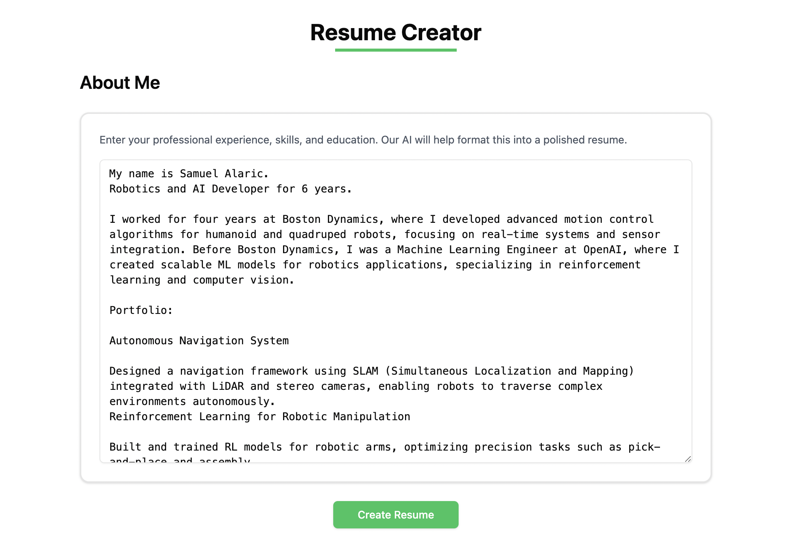

# Building Resume Creator with Multi-agent AI


Photo by [João Ferrão](https://unsplash.com/@joaofferrao?utm_content=creditCopyText&utm_medium=referral&utm_source=unsplash) on [Unsplash](https://unsplash.com/photos/white-printer-paper-on-macbook-pro-4YzrcDNcRVg?utm_content=creditCopyText&utm_medium=referral&utm_source=unsplash)

In this blog, we will build an AI-powered resume creation system that automates the tedious and time-consuming tasks involved in manual resume creation. By leveraging multi-agent AI systems, we will streamline the process of information gathering, and content writing to produce resumes with minimal human intervention.

## Limitations of Manual Resume Processing

### Inefficient Information Gathering

The manual process of collecting and organizing information is time-consuming and requires significant effort.

### Inconsistent Formatting

Manual resume creation often leads to formatting inconsistencies. The process requires manual adjustments to maintain professional formatting standards, which can be error-prone and time-consuming.

### Content Writing and Rewriting Challenges

The manual process requires significant effort in crafting and editing content. Writing compelling and well-structured content by hand is labor-intensive, requiring multiple revisions and edits.

## Automating Resume Creation using AI

Creating a resume manually involves several steps:

1. **Information Gathering**: Collecting and organizing your personal details, job history, skills, and education.
2. **Formatting**: Ensuring the resume looks attractive and professional, often without clear guidelines.
3. **Content Writing**: Crafting and refining content to make it concise, compelling, and relevant.
4. **Proofreading and Editing**: Checking for errors and polishing the resume to a professional standard.

With the AI system, we can automate these steps using multi-agent systems. Each agent performs a specific task, such as extracting information, generating content, or formatting the resume. By coordinating these agents, we can create a fully automated resume creation system.

## How it Works?

In this blog, we automate the **information gathering** and **content writing** for the resume, tasks that are usually manual and time-consuming.

This system diagram illustrates the resume creation process discussed in this blog, showcasing the collaboration between two main AI agents:


Here's a brief description:

- The system starts with **User Input** and requires an environment setup that includes **Team Initialization** and **OpenAI API Key**.

- Two AI agents work together:
  - **Profile Analyst (Agent AI 1)**: Handles data extraction from user input, breaking down information into categories like **Name**, **Experience**, **Skills**, **Education**, and **Job History**.
  - **Resume Writer (Agent AI 2)**: Takes the structured information and handles the writing aspect.

- The workflow follows these key steps:
  - **Data Extraction**: Organizes raw user input into. structured categories. This the information gathering step.
  - **Structured Information**: Stores the organized data into the GridDB Cloud database.
  - **Resume Crafting**: Combines the structured data with writing capabilities. This the content writing step.
  - **Create Resume**: Generates the content.
  - **Final Resume**: Produces the completed document.

## Prerequisites

### KaibanJS

[KaibanJS](https://www.kaibanjs.com/) is the JavaScript framework for building multi-agent AI systems. We will use it to build our resume creation system.

### OpenAI

We will use the [`o1-mini`](https://platform.openai.com/docs/models#o1) model from OpenAI. It is a smaller version of the `o1` model, suitable for tasks that require complex reasoning and understanding.

Create a project, an API key, and enable the `o1-mini` model in the [OpenAI platform](https://platform.openai.com/). Make sure to save the API key in the `.env` file.

```ini
OPENAI_API_KEY=api-key-here
```

### GridDB Cloud

The GridDB Cloud offers a free plan tier and is officially available worldwide. This database will store the structured information extracted by the **Profile Analyst** agent and also the final resume generated by the **Resume Writer** agent.

You need these GridDB environment variables in the `.env` file:

```ini
GRIDDB_WEBAPI_URL=
GRIDDB_USERNAME=
GRIDDB_PASSWORD=
```

Check the below section on how to get these values.

#### GridDB WebAPI URL

Go to the GridDB Cloud portal and copy the WebAPI URL from the **Clusters** section. It should look like this:


#### GridDB Username and Password

Go to the **GridDB Users** section of the GridDB Cloud portal and cretae or copy the username for `GRIDDB_USERNAME`. The password is set when the user is created for the first time, use this as the `GRIDDB_PASSWORD`.


For more details, to get started with GridDB Cloud, please follow this [quick start guide](https://griddb.net/en/blog/griddb-cloud-quick-start-guide/).

### Node.js

We will use Node.js LTS v22.12.0 to build a server that handles the communication between the user interface, AI agents and OpenAI API and store data into the GridDB Cloud database.

### React

We will use React to build the user interface for the resume creation system. Where the user can input their details and generate a resume with click of a button.

## Building the Resume Creation System

### Server Setup

### Multi-agent AI

#### Profile Analyst (Agent AI 1)

#### Resume Writer (Agent AI 2)

### Save Data to GridDB Cloud Database

### User Interface


